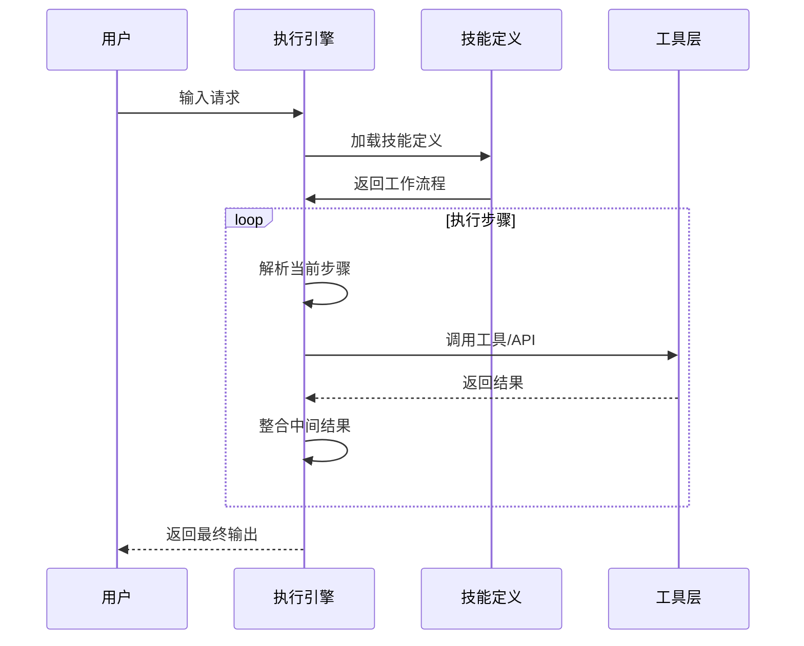
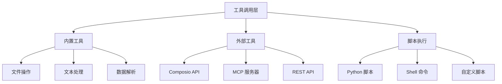
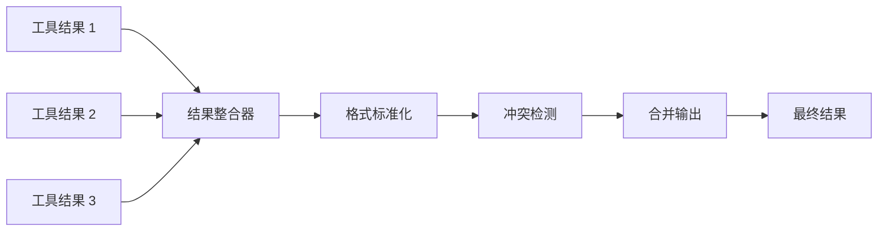
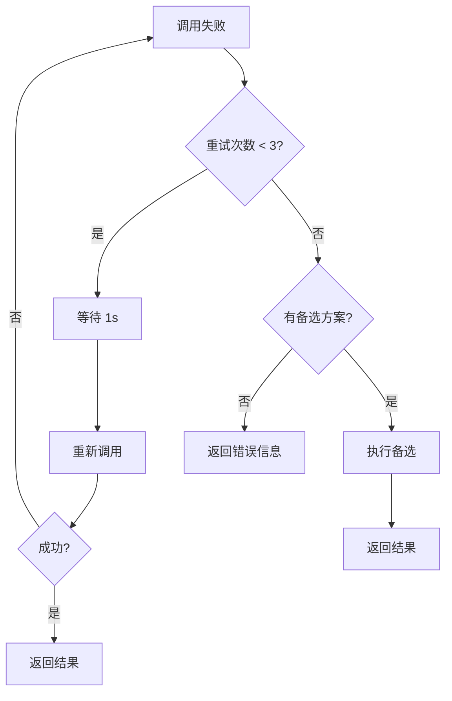

# 执行引擎

<Abs title="摘要" :keywords="['执行引擎', '工具调用', 'ReAct', '技能组合', '结果整合']">
执行引擎是 Claude Skills 系统的核心组件，负责技能的实际执行、工具调用和结果整合。本章分析执行引擎的设计原理、调用模式和错误处理机制。
</Abs>

## 1. 执行流程概览

## 2. 工具调用层

### 工具类型

### 调用模式

| 模式 | 特点 | 适用场景 |
|:---|:---|:---|
| 同步调用 | 等待结果返回 | 单步操作 |
| 异步调用 | 后台执行 | 长时间任务 |
| 批量调用 | 并行执行 | 多数据处理 |
| 链式调用 | 顺序依赖 | 流程化任务 |

## 3. 结果整合机制

### 整合流程

### 处理策略

| 情况 | 处理方式 |
|:---|:---|
| 单一结果 | 直接返回 |
| 多结果一致 | 合并展示 |
| 多结果冲突 | 标注差异，由用户选择 |
| 结果缺失 | 补充默认值或提示 |

## 4. 错误处理

### 错误类型

| 类型 | 原因 | 处理方式 |
|:---|:---|:---|
| 工具调用失败 | API 错误、网络问题 | 重试 + 备选方案 |
| 格式不匹配 | 输入不符合预期 | 修正 + 提示 |
| 执行超时 | 任务过长 | 分段执行 + 缓存 |
| 资源缺失 | 文件/脚本不存在 | 提示 + 创建 |

### 重试机制

## 5. 性能监控

### 监控指标

| 指标 | 描述 | 目标值 |
|:---|:---|:---|
| 执行延迟 | 从调用到返回的时间 | < 5s |
| 工具成功率 | 工具调用成功比例 | > 95% |
| Token 效率 | 输出 token / 输入 token | > 0.5 |
| 缓存命中率 | 缓存资源的使用比例 | > 30% |

### 优化策略

1. **预加载**: 高频工具提前初始化
2. **并行化**: 独立步骤同时执行
3. **缓存**: 结果缓存减少重复计算
4. **流式输出**: 长输出分段返回

## 参考文献

<ol>
<li id="ref-1">Anthropic (2024). "Agent Skills: Equipping Agents for the Real World." <em>Anthropic Engineering Blog</em>. <a href="https://www.anthropic.com/engineering/equipping-agents-for-the-real-world-with-agent-skills">https://www.anthropic.com/engineering/equipping-agents-for-the-real-world-with-agent-skills</a></li>
</ol>