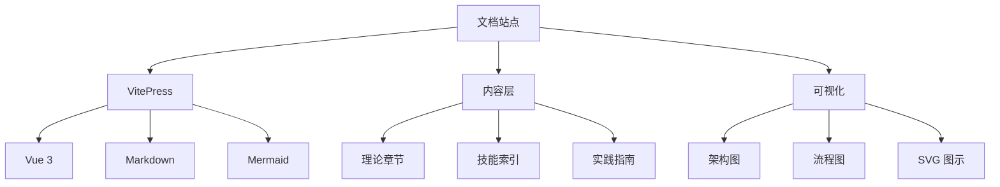

# 系统架构

<Abs title="章节概述" :keywords="['系统架构', 'VitePress', '渐进式加载', '执行引擎', '跨平台']">
本章详细阐述 Claude Skills 中文版文档站点的技术架构。我们从整体架构出发，分析 VitePress 文档系统的设计、内容的组织方式、以及与 Claude Skills 系统的映射关系。理解本章内容有助于读者深入理解文档站点的技术实现。
</Abs>

## 章节内容

| 章节 | 内容概要 |
|:---|:---|
| [渐进式加载](./loading) | 三级元数据加载机制详解 |
| [执行引擎](./execution) | 技能执行与工具调用流程 |

## 技术栈概览



## 文档组织结构

```
docs/
├── .vitepress/          # VitePress 配置
│   ├── config.ts        # 站点配置
│   └── theme/           # 自定义主题
│       ├── style.css    # 论文风格样式
│       └── components/  # Vue 组件
├── theory/              # 理论章节
├── architecture/        # 架构章节
├── skills/              # 技能索引
├── practice/            # 实践指南
├── reference/           # 参考资料
└── media/               # SVG 图示
```

## 与 Claude Skills 系统的映射

| 文档章节 | Skills 系统 | 说明 |
|:---|:---|:---|
| theory/agent-arch | ReAct 模式 | 推理-行动循环 |
| theory/prompt-eng | SKILL.md 设计 | 提示工程实现 |
| theory/skill-system | 加载机制 | 三级渐进加载 |
| skills/ | 技能索引 | 所有可用技能 |
| practice/ | 使用方式 | 实践应用 |