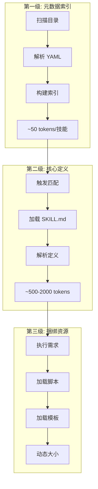
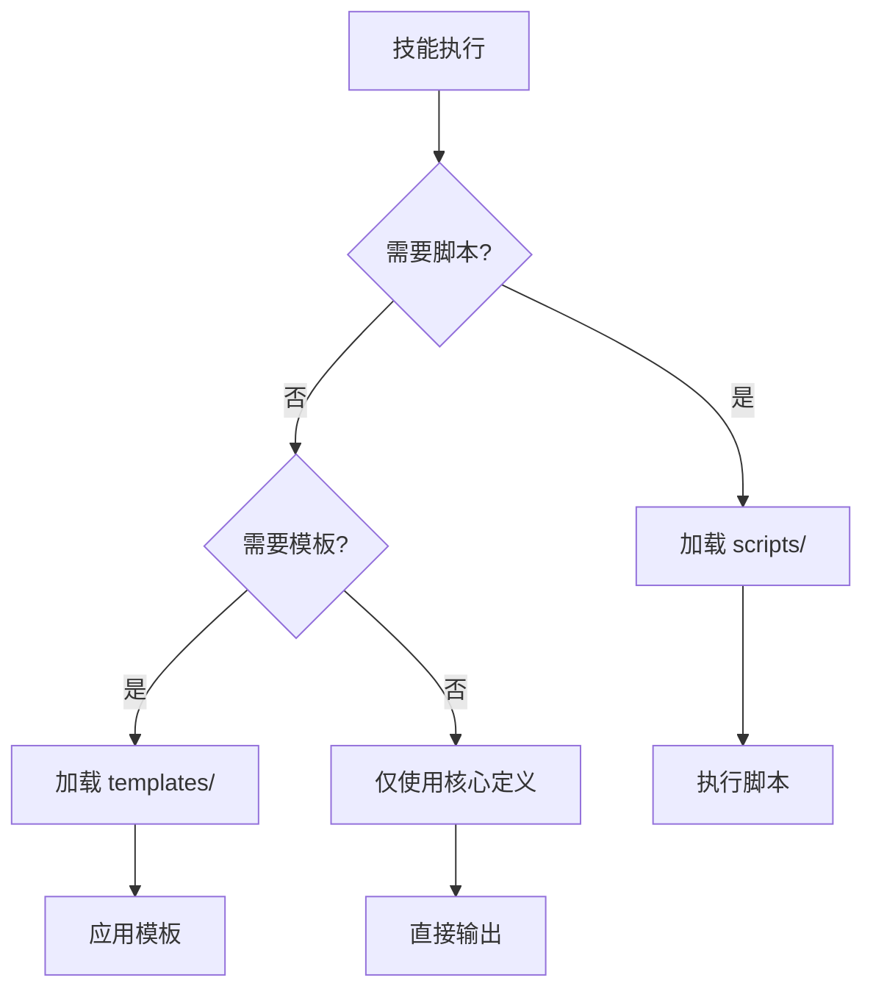

# 渐进式加载机制

<Abs title="摘要" :keywords="['渐进加载', '元数据', '上下文优化', '三级加载', '性能']">
Claude Skills 采用三级渐进加载机制，有效解决 LLM 上下文窗口限制问题。本章详细分析每一级加载的设计原理、数据结构和性能优化策略。
</Abs>

## 1. 设计动机

### 问题背景

LLM 的上下文窗口有限，一次性加载所有技能会：

- 占用大量 token 预算
- 降低响应效率
- 增加匹配噪声

### 解决方案

**渐进式加载**: 按需加载技能内容，仅在触发时才加载完整定义。

## 2. 三级加载架构



## 3. 第一级: 元数据索引

### 加载时机

Claude Code 启动时，扫描所有技能目录。

### 数据结构

```yaml
---
name: document-skills
description: 文档处理技能合集
license: Apache-2.0
---
```

### 索引构建

```json
{
  "skills": [
    {
      "name": "document-skills",
      "description": "文档处理技能合集",
      "path": "/path/to/skill"
    }
  ]
}
```

### 性能特性

| 指标 | 数值 |
|:---|:---|
| 单技能 token | ~50 |
| 100 技能总计 | ~5000 |
| 扫描时间 | ~100ms |

## 4. 第二级: 核心定义

### 加载时机

用户查询与技能描述匹配度高于阈值时触发。

### 加载条件

```mermaid
graph LR
    A[用户查询] --> B[语义匹配]
    B --> C{分数 > 阈值?}
    C -->|是| D[加载 SKILL.md]
    C -->|否| E[跳过]

    style C fill:#b1b1b8
    style D fill:#2d4a6f
```



### 内容范围

加载 SKILL.md 的所有内容：

- 何时使用此技能
- 详细说明
- 示例

### 内存管理

| 策略 | 描述 |
|:---|:---|
| 缓存 | 高频技能保留在内存 |
| 预加载 | 用户偏好技能提前加载 |
| 清理 | 低频技能定期清理 |

## 5. 第三级: 捆绑资源

### 加载时机

技能执行需要辅助脚本或模板时。

### 资源类型

| 类型 | 目录 | 用途 |
|:---|:---|:---|
| 脚本 | scripts/ | Python/Bash 执行脚本 |
| 模板 | templates/ | 输出格式模板 |
| 参考资料 | references/ | API 文档等 |

### 加载策略



## 6. 性能优化

### 优化策略

| 策略 | 效果 | 实现方式 |
|:---|:---|:---|
| 紧凑元数据 | 减少 L1 token | 精简 description |
| 条件加载 | 减少不必要的 L2 | 优化触发阈值 |
| 延迟加载 | 减少 L3 开销 | 按需加载资源 |
| 缓存策略 | 加速重复调用 | 内存缓存高频技能 |

### Token 预算示例

| 场景 | L1 | L2 | L3 | 总计 |
|:---|:---|:---|:---|:---|
| 简单查询 | 5000 | 0 | 0 | 5000 |
| 单技能执行 | 5000 | 1000 | 500 | 6500 |
| 多技能组合 | 5000 | 3000 | 1000 | 9000 |

## 参考文献

<ol>
<li id="ref-1">Anthropic (2024). "Agent Skills: Equipping Agents for the Real World." <em>Anthropic Engineering Blog</em>. <a href="https://www.anthropic.com/engineering/equipping-agents-for-the-real-world-with-agent-skills">https://www.anthropic.com/engineering/equipping-agents-for-the-real-world-with-agent-skills</a></li>
</ol>