# GitHub Pages 学术论文风格重构实施计划

> **For agentic workers:** REQUIRED SUB-SKILL: Use superpowers:subagent-driven-development (recommended) or superpowers:executing-plans to implement this plan task-by-task. Steps use checkbox (`- [ ]`) syntax for tracking.

**Goal:** 将 GitHub Pages 从工具文档重构为学术论文级技术白皮书站点

**Architecture:** VitePress + 自定义论文主题 CSS + Mermaid/SVG 可视化 + 学术引用系统

**Tech Stack:** VitePress, Vue 3, CSS Custom Properties, Mermaid, SVG

---

## 文件结构

### 创建文件
- `docs/.vitepress/theme/style.css` — 重写论文风格样式
- `docs/.vitepress/theme/components/Abs.vue` — 摘要块组件
- `docs/.vitepress/theme/components/Cite.vue` — 引用组件
- `docs/.vitepress/theme/components/Section.vue` — 章节组件
- `docs/theory/index.md` — 理论首页
- `docs/theory/agent-arch.md` — 智能体架构理论
- `docs/theory/prompt-eng.md` — 提示工程原理
- `docs/theory/skill-system.md` — Skills 系统设计
- `docs/architecture/index.md` — 架构总览
- `docs/architecture/loading.md` — 渐进式加载机制
- `docs/architecture/execution.md` — 执行引擎
- `docs/reference/bibliography.md` — 参考文献
- `docs/reference/related.md` — 相关项目
- `docs/media/agent-architecture.svg` — Agent 架构图
- `docs/media/skill-loading.svg` — Skills 加载流程图

### 修改文件
- `docs/.vitepress/config.ts` — 导航和侧边栏配置
- `docs/.vitepress/theme/index.ts` — 注册组件
- `docs/index.md` — 学术首页
- `docs/skills/index.md` — 技能索引增强
- `docs/guides/getting-started.md` — 移动到 practice
- `docs/playbooks/index.md` — 移动到 practice
- `docs/resources.md` — 移动到 reference
- `docs/about.md` — 更新关于页面
- `docs/contribute.md` — 更新贡献指南

---

## Task 1: 重写 VitePress 主题样式

**Files:**
- Modify: `docs/.vitepress/theme/style.css`

### Step 1: 清空现有样式，写入论文基础变量

```css
/**
 * Awesome Claude Skills 中文版 — 学术论文风格
 * 参考: ACM Digital Library / arXiv 排版规范
 */

/* === 学术论文配色系统 === */
:root {
  /* 灰度色阶 */
  --vp-c-white: #ffffff;
  --vp-c-black: #1a1a2e;
  --vp-c-gray-1: #2d2d44;
  --vp-c-gray-2: #4a4a5e;
  --vp-c-gray-3: #6b6b7d;
  --vp-c-gray-4: #8e8e9a;
  --vp-c-gray-5: #b1b1b8;
  --vp-c-gray-6: #d4d4d8;
  --vp-c-gray-7: #e8e8ea;
  --vp-c-gray-8: #f5f5f0;

  /* 学术强调色 */
  --vp-c-accent: #1e3a5f;
  --vp-c-accent-light: #2d4a6f;
  --vp-c-accent-dark: #0f2a4f;
  --vp-c-gold: #b8860b;
  --vp-c-gold-light: #daa520;

  /* 背景 */
  --vp-c-bg: #ffffff;
  --vp-c-bg-alt: #fafaf8;
  --vp-c-bg-soft: #f5f5f0;

  /* 文字 */
  --vp-c-text-1: #1a1a2e;
  --vp-c-text-2: #2d2d44;
  --vp-c-text-3: #4a4a5e;
  --vp-c-text-code: #1e3a5f;

  /* 边框 */
  --vp-c-border: #d4d4d8;
  --vp-c-divider: #e8e8ea;

  /* 学术排版间距 */
  --vp-layout-max-width: 900px;
  --vp-content-width: 720px;
  --vp-sidebar-width: 260px;

  /* 字体 */
  --vp-font-family-base: "Noto Sans SC", "Source Han Sans CN", "PingFang SC", "Microsoft YaHei", -apple-system, sans-serif;
  --vp-font-family-serif: "Noto Serif SC", "Source Han Serif CN", "LXGW WenKai", "STSong", Georgia, serif;
  --vp-font-family-mono: "JetBrains Mono", "Fira Code", "Source Code Pro", monospace;

  /* 行高与字号 */
  --vp-line-height-base: 1.8;
  --vp-line-height-tight: 1.5;
  --vp-font-size-base: 16px;
  --vp-font-size-sm: 14px;
  --vp-font-size-xs: 13px;
}
```

### Step 2: 添加全局排版样式

```css
/* === 全局排版 === */
html {
  font-size: var(--vp-font-size-base);
  -webkit-font-smoothing: antialiased;
  -moz-osx-font-smoothing: grayscale;
}

body {
  font-family: var(--vp-font-family-base);
  line-height: var(--vp-line-height-base);
  color: var(--vp-c-text-1);
  background: var(--vp-c-bg);
  text-rendering: optimizeLegibility;
}

/* 移除深色模式切换按钮 */
.VPSwitch {
  display: none !important;
}

/* === 导航栏 === */
.VPNav {
  background: var(--vp-c-bg);
  border-bottom: 1px solid var(--vp-c-divider);
  box-shadow: 0 1px 3px rgba(0, 0, 0, 0.04);
}

.VPNavBar {
  max-width: var(--vp-layout-max-width);
  margin: 0 auto;
  padding: 0 24px;
}

.VPNavBarTitle .title {
  font-family: var(--vp-font-family-serif);
  font-size: 18px;
  font-weight: 600;
  color: var(--vp-c-text-1);
  letter-spacing: 0.5px;
}

.VPNavBarMenuLink,
.VPNavBarMenuGroup .button {
  font-size: var(--vp-font-size-sm);
  font-weight: 500;
  color: var(--vp-c-text-2);
  letter-spacing: 0.3px;
}

.VPNavBarMenuLink:hover,
.VPNavBarMenuGroup:hover .button {
  color: var(--vp-c-accent);
}

.VPNavBarMenuLink.active {
  color: var(--vp-c-accent);
  border-bottom: 2px solid var(--vp-c-accent);
}
```

### Step 3: 添加内容区论文样式

```css
/* === 内容区 === */
.VPDoc {
  max-width: var(--vp-layout-max-width);
  margin: 0 auto;
  padding: 48px 24px 96px;
}

.vp-doc {
  font-size: var(--vp-font-size-base);
  line-height: var(--vp-line-height-base);
}

/* 标题样式 */
.vp-doc h1 {
  font-family: var(--vp-font-family-serif);
  font-size: 32px;
  font-weight: 600;
  line-height: var(--vp-line-height-tight);
  color: var(--vp-c-text-1);
  margin: 0 0 24px;
  padding-bottom: 12px;
  border-bottom: 2px solid var(--vp-c-accent);
  counter-reset: h2-counter;
}

.vp-doc h1::before {
  content: "";
  display: block;
  width: 48px;
  height: 4px;
  background: var(--vp-c-gold);
  margin-bottom: 16px;
}

.vp-doc h2 {
  font-family: var(--vp-font-family-serif);
  font-size: 24px;
  font-weight: 600;
  line-height: var(--vp-line-height-tight);
  color: var(--vp-c-text-1);
  margin: 48px 0 20px;
  counter-reset: h3-counter;
  counter-increment: h2-counter;
}

.vp-doc h2::before {
  content: counter(h2-counter) ". ";
  color: var(--vp-c-accent);
  font-weight: 600;
  margin-right: 8px;
}

.vp-doc h3 {
  font-family: var(--vp-font-family-serif);
  font-size: 20px;
  font-weight: 600;
  line-height: var(--vp-line-height-tight);
  color: var(--vp-c-text-2);
  margin: 32px 0 16px;
  counter-increment: h3-counter;
}

.vp-doc h3::before {
  content: counter(h2-counter) "." counter(h3-counter) " ";
  color: var(--vp-c-accent);
  font-weight: 500;
  font-size: 0.9em;
  margin-right: 6px;
}

/* 段落与正文 */
.vp-doc p {
  margin: 0 0 16px;
  text-align: justify;
  hyphens: auto;
}

.vp-doc a {
  color: var(--vp-c-accent);
  text-decoration: none;
  border-bottom: 1px solid transparent;
  transition: border-color 0.2s ease;
}

.vp-doc a:hover {
  border-bottom-color: var(--vp-c-accent);
}

/* 代码块 */
.vp-doc code {
  font-family: var(--vp-font-family-mono);
  font-size: 0.9em;
  background: var(--vp-c-bg-soft);
  padding: 2px 6px;
  border-radius: 3px;
  color: var(--vp-c-text-code);
}

.vp-doc pre {
  background: var(--vp-c-bg-soft);
  border: 1px solid var(--vp-c-border);
  border-radius: 6px;
  padding: 16px 20px;
  overflow-x: auto;
  margin: 20px 0;
}

.vp-doc pre code {
  background: transparent;
  padding: 0;
}

/* 引用块 */
.vp-doc blockquote {
  border-left: 3px solid var(--vp-c-accent);
  margin: 24px 0;
  padding: 16px 20px;
  background: var(--vp-c-bg-alt);
  font-style: italic;
  color: var(--vp-c-text-2);
}

/* 列表 */
.vp-doc ul,
.vp-doc ol {
  margin: 16px 0;
  padding-left: 24px;
}

.vp-doc li {
  margin: 8px 0;
  line-height: var(--vp-line-height-base);
}
```

### Step 4: 添加表格与特殊元素样式

```css
/* === 表格 === */
.vp-doc table {
  width: 100%;
  border-collapse: collapse;
  margin: 24px 0;
  font-size: var(--vp-font-size-sm);
}

.vp-doc th {
  font-family: var(--vp-font-family-serif);
  font-weight: 600;
  text-align: left;
  padding: 12px 16px;
  background: var(--vp-c-bg-alt);
  border-bottom: 2px solid var(--vp-c-accent);
}

.vp-doc td {
  padding: 12px 16px;
  border-bottom: 1px solid var(--vp-c-divider);
  vertical-align: top;
}

.vp-doc tr:hover td {
  background: var(--vp-c-bg-soft);
}

/* === 侧边栏 === */
.VPSidebar {
  background: var(--vp-c-bg);
  border-right: 1px solid var(--vp-c-divider);
}

.VPSidebarGroup .title {
  font-family: var(--vp-font-family-serif);
  font-size: 12px;
  font-weight: 600;
  text-transform: uppercase;
  letter-spacing: 1px;
  color: var(--vp-c-text-3);
  padding: 12px 16px;
}

.VPSidebarItem .text {
  font-size: var(--vp-font-size-sm);
  padding: 8px 16px;
  border-radius: 4px;
  transition: all 0.15s ease;
}

.VPSidebarItem .text:hover {
  background: var(--vp-c-bg-soft);
  color: var(--vp-c-accent);
}

.VPSidebarItem.is-active .text {
  background: var(--vp-c-bg-soft);
  color: var(--vp-c-accent);
  font-weight: 500;
  border-left: 3px solid var(--vp-c-accent);
  margin-left: -3px;
}

/* === 页脚 === */
.VPFooter {
  background: var(--vp-c-bg-alt);
  border-top: 1px solid var(--vp-c-divider);
  padding: 32px 24px;
  text-align: center;
}

.VPFooter .message,
.VPFooter .copyright {
  font-size: var(--vp-font-size-sm);
  color: var(--vp-c-text-3);
}

/* === 自定义容器 === */
.vp-doc .custom-block {
  border-radius: 6px;
  padding: 16px 20px;
  margin: 24px 0;
  border-left: 3px solid var(--vp-c-accent);
  background: var(--vp-c-bg-soft);
}

.vp-doc .custom-block .title {
  font-family: var(--vp-font-family-serif);
  font-weight: 600;
  font-size: var(--vp-font-size-base);
  margin-bottom: 8px;
}

.vp-doc .custom-block.info {
  border-left-color: var(--vp-c-accent);
}

.vp-doc .custom-block.tip {
  border-left-color: var(--vp-c-gold);
  background: rgba(184, 134, 11, 0.06);
}

.vp-doc .custom-block.warning {
  border-left-color: #8b4513;
  background: rgba(139, 69, 19, 0.06);
}

/* === Mermaid 图表样式 === */
.mermaid {
  text-align: center;
  margin: 32px 0;
  background: var(--vp-c-bg);
  padding: 24px;
  border-radius: 8px;
  border: 1px solid var(--vp-c-divider);
}

/* === 响应式 === */
@media (max-width: 768px) {
  :root {
    --vp-font-size-base: 15px;
  }

  .VPDoc {
    padding: 32px 16px 64px;
  }

  .vp-doc h1 {
    font-size: 28px;
  }

  .vp-doc h2 {
    font-size: 22px;
  }
}
```

---

## Task 2: 创建 Vue 组件

**Files:**
- Create: `docs/.vitepress/theme/components/Abs.vue`
- Create: `docs/.vitepress/theme/components/Cite.vue`
- Create: `docs/.vitepress/theme/components/Section.vue`

### Step 1: 创建摘要块组件 Abs.vue

```vue
<script setup>
defineProps({
  title: { type: String, default: '摘要' },
  keywords: { type: Array, default: () => [] }
})
</script>

<template>
  <div class="abstract-block">
    <div class="abstract-header">
      <span class="abstract-label">{{ title }}</span>
    </div>
    <div class="abstract-content">
      <slot />
    </div>
    <div v-if="keywords.length" class="abstract-keywords">
      <span class="keywords-label">关键词:</span>
      <span v-for="kw in keywords" :key="kw" class="keyword">{{ kw }}</span>
    </div>
  </div>
</template>

<style scoped>
.abstract-block {
  margin: 32px 0;
  padding: 24px;
  background: var(--vp-c-bg-alt);
  border: 1px solid var(--vp-c-divider);
  border-radius: 6px;
}

.abstract-header {
  margin-bottom: 12px;
}

.abstract-label {
  font-family: var(--vp-font-family-serif);
  font-weight: 600;
  font-size: 14px;
  text-transform: uppercase;
  letter-spacing: 2px;
  color: var(--vp-c-accent);
}

.abstract-content {
  font-size: 15px;
  line-height: 1.8;
  color: var(--vp-c-text-2);
}

.abstract-keywords {
  margin-top: 16px;
  padding-top: 12px;
  border-top: 1px solid var(--vp-c-divider);
  font-size: 13px;
}

.keywords-label {
  font-weight: 500;
  color: var(--vp-c-text-3);
  margin-right: 8px;
}

.keyword {
  display: inline-block;
  background: var(--vp-c-bg-soft);
  padding: 2px 8px;
  margin: 2px 4px 2px 0;
  border-radius: 3px;
  font-size: 12px;
  color: var(--vp-c-accent);
}
</style>
```

### Step 2: 创建引用组件 Cite.vue

```vue
<script setup>
defineProps({
  refs: { type: Array, required: true }
})
</script>

<template>
  <sup class="cite">
    <a
      v-for="(ref, i) in refs"
      :key="i"
      :href="`#ref-${ref}`"
      class="cite-link"
    >[{{ ref }}]</a>
  </sup>
</template>

<style scoped>
.cite {
  font-size: 0.75em;
  vertical-align: super;
  margin: 0 1px;
}

.cite-link {
  color: var(--vp-c-accent);
  text-decoration: none;
}

.cite-link:hover {
  text-decoration: underline;
}

.cite-link + .cite-link::before {
  content: ",";
}
</style>
```

### Step 3: 创建章节组件 Section.vue

```vue
<script setup>
defineProps({
  id: { type: String, required: true },
  title: { type: String, required: true }
})
</script>

<template>
  <section :id="id" class="doc-section">
    <h2 class="section-title">
      <span class="section-marker">§</span>
      {{ title }}
    </h2>
    <slot />
  </section>
</template>

<style scoped>
.doc-section {
  margin: 48px 0;
}

.section-title {
  font-family: var(--vp-font-family-serif);
  font-size: 22px;
  font-weight: 600;
  color: var(--vp-c-text-1);
  margin: 0 0 20px;
  padding-bottom: 8px;
  border-bottom: 1px solid var(--vp-c-divider);
}

.section-marker {
  color: var(--vp-c-gold);
  margin-right: 8px;
}
</style>
```

---

## Task 3: 更新主题入口注册组件

**Files:**
- Modify: `docs/.vitepress/theme/index.ts`

```typescript
import DefaultTheme from 'vitepress/theme'
import Abs from './components/Abs.vue'
import Cite from './components/Cite.vue'
import Section from './components/Section.vue'
import './style.css'

export default {
  extends: DefaultTheme,
  enhanceApp({ app }) {
    app.component('Abs', Abs)
    app.component('Cite', Cite)
    app.component('Section', Section)
  }
}
```

---

## Task 4: 更新 VitePress 配置

**Files:**
- Modify: `docs/.vitepress/config.ts`

完整配置：

```typescript
import { defineConfig } from 'vitepress'
import { withMermaid } from 'vitepress-plugin-mermaid'
import llmstxt from 'vitepress-plugin-llms'

const rawBase = process.env.VITEPRESS_BASE
const base = rawBase
  ? rawBase.startsWith('/')
    ? rawBase.endsWith('/') ? rawBase : `${rawBase}/`
    : `/${rawBase}/`
  : '/'

export default withMermaid(defineConfig({
  base,
  title: 'Awesome Claude Skills 中文版',
  description: 'AI Agent 技能系统 · 技术白皮书',
  lang: 'zh-CN',

  head: [
    ['link', { rel: 'preconnect', href: 'https://fonts.googleapis.com' }],
    ['link', { rel: 'preconnect', href: 'https://fonts.gstatic.com', crossorigin: '' }],
    ['link', { href: 'https://fonts.googleapis.com/css2?family=Noto+Sans+SC:wght@400;500;600;700&family=Noto+Serif+SC:wght@400;600;700&family=JetBrains+Mono:wght@400;500&display=swap', rel: 'stylesheet' }],
  ],

  ignoreDeadLinks: [
    /\.\.\/AGENTS/,
  ],

  themeConfig: {
    nav: [
      { text: '理论', link: '/theory/', activeMatch: '/theory/' },
      { text: '架构', link: '/architecture/', activeMatch: '/architecture/' },
      { text: '技能', link: '/skills/', activeMatch: '/skills/' },
      { text: '实践', link: '/practice/', activeMatch: '/practice/' },
      { text: '参考', link: '/reference/', activeMatch: '/reference/' },
    ],
    sidebar: {
      '/theory/': [
        {
          text: '理论',
          items: [
            { text: '概述', link: '/theory/' },
            { text: '智能体架构', link: '/theory/agent-arch' },
            { text: '提示工程', link: '/theory/prompt-eng' },
            { text: 'Skills 系统', link: '/theory/skill-system' },
          ],
        },
      ],
      '/architecture/': [
        {
          text: '架构',
          items: [
            { text: '架构总览', link: '/architecture/' },
            { text: '渐进式加载', link: '/architecture/loading' },
            { text: '执行引擎', link: '/architecture/execution' },
          ],
        },
      ],
      '/skills/': [
        {
          text: '技能索引',
          items: [
            { text: '概览', link: '/skills/' },
          ],
        },
      ],
      '/practice/': [
        {
          text: '实践',
          items: [
            { text: '概述', link: '/practice/' },
            { text: '入门指南', link: '/practice/getting-started' },
            { text: '实战手册', link: '/practice/playbooks' },
          ],
        },
      ],
      '/reference/': [
        {
          text: '参考资料',
          items: [
            { text: '概览', link: '/reference/' },
            { text: '参考文献', link: '/reference/bibliography' },
            { text: '相关项目', link: '/reference/related' },
            { text: '架构决策', link: '/reference/adr' },
          ],
        },
      ],
    },
    outline: [2, 3],
    search: { provider: 'local' },
    socialLinks: [
      { icon: 'github', link: 'https://github.com/LessUp/awesome-claude-skills-zh' },
    ],
    footer: {
      message: 'Apache License 2.0',
      copyright: 'Maintained by LessUp',
    },
  },

  vite: {
    plugins: [llmstxt()],
  },
}))
```

---

## Task 5: 创建学术首页

**Files:**
- Modify: `docs/index.md`

```markdown
---
layout: doc
---

<Abs title="摘要" :keywords="['Claude Skills', 'AI Agent', '提示工程', '智能体架构', '渐进式加载']">
Awesome Claude Skills 中文版是一个面向高级开发者和 AI Agent 研究者的技术白皮书站点。本文档系统阐述 Claude Skills 的理论基础、系统架构与实践应用。我们从智能体架构理论出发，深入分析提示工程原理、Skills 系统的三级渐进加载机制，以及跨平台执行引擎的设计与实现。本站点收录 70+ 精选技能，覆盖文档处理、开发工具、数据分析等 10 个核心领域，为构建生产级 AI 应用提供可复用的技术组件。
</Abs>

## 核心数据

| 指标 | 数值 |
|:---|:---|
| 本地技能 | 29 |
| 外部技能 | 11 |
| Composio 技能 | 832 |
| 总计 | 872 |
| 分类领域 | 10 |
| Composio 应用 | 78 |

## 文档结构

本站采用递进式内容组织，引导读者从理论到实践：

1. **理论** — AI Agent 架构理论、提示工程原理、Skills 系统设计
2. **架构** — 系统架构总览、渐进式加载机制、执行引擎
3. **技能** — 按领域分类的技能索引
4. **实践** — 入门指南与实战手册
5. **参考** — 参考文献、相关项目、架构决策记录

## 快速导航

| 目标 | 推荐入口 |
|:---|:---|
| 理解 Skills 理论基础 | [智能体架构](/theory/agent-arch) |
| 了解系统设计原理 | [架构总览](/architecture/) |
| 查找特定技能 | [技能索引](/skills/) |
| 快速上手使用 | [入门指南](/practice/getting-started) |
| 解决实际问题 | [实战手册](/practice/playbooks) |
| 深入研究参考 | [参考文献](/reference/bibliography) |

## 引用本文档

如需在学术文章中引用本站内容，建议格式：

```bibtex
@misc{awesome-claude-skills-zh,
  title     = {Awesome Claude Skills 中文版},
  author    = {LessUp},
  year      = {2026},
  howpublished = {\\url{https://lessup.github.io/awesome-claude-skills-zh/}},
  note      = {Accessed: 2026-05-17}
}
```
```

---

## Task 6: 创建理论章节

**Files:**
- Create: `docs/theory/index.md`
- Create: `docs/theory/agent-arch.md`
- Create: `docs/theory/prompt-eng.md`
- Create: `docs/theory/skill-system.md`

### Step 1: 创建理论首页

```markdown
---
title: 理论
---

# 理论基础

<Abs title="章节概述" :keywords="['AI Agent', '提示工程', 'Skills 系统', '理论基础']">
本章阐述 Claude Skills 的理论基础。我们从智能体架构的通用框架出发，分析 ReAct、Chain-of-Thought 等核心推理模式，探讨提示工程的设计原则，最后深入 Skills 系统的设计哲学与实现原理。理解这些理论基础，是有效使用和扩展 Claude Skills 的前提。
</Abs>

## 章节内容

| 章节 | 内容概要 |
|:---|:---|
| [智能体架构](./agent-arch) | Agent 通用架构、推理模式、工具使用理论 |
| [提示工程](./prompt-eng) | 系统提示设计、Few-shot 学习、CoT 变体 |
| [Skills 系统](./skill-system) | 技能抽象、渐进加载、激活机制 |

## 阅读建议

1. **初学者**: 建议先阅读 [技能系统](./skill-system) 了解基本概念，再回溯理论基础
2. **研究者**: 可按顺序阅读，建立完整理论框架
3. **实践者**: 重点阅读 [提示工程](./prompt-eng) 的设计模式部分

## 核心概念预览

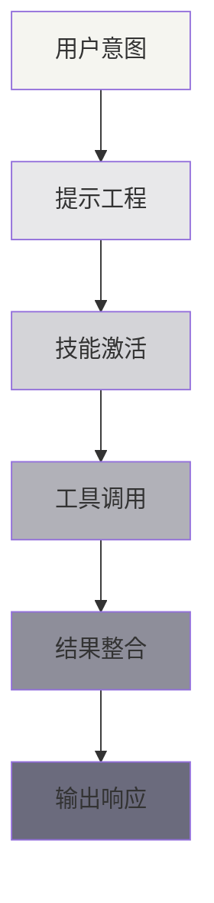

## 参考文献导引

本章内容参考了以下核心文献：

- Wei et al. (2022) "Chain-of-Thought Prompting Elicits Reasoning in Large Language Models"<Cite :refs="[1]" />
- Yao et al. (2022) "ReAct: Synergizing Reasoning and Acting in Language Models"<Cite :refs="[2]" />
- Anthropic (2024) "Agent Skills: Equipping Agents for the Real World"<Cite :refs="[3]" />

完整参考文献见 [参考文献](/reference/bibliography)。
```

### Step 2: 创建智能体架构文档

```markdown
---
title: 智能体架构理论
---

# 智能体架构理论

<Abs title="摘要" :keywords="['AI Agent', 'ReAct', 'Chain-of-Thought', 'Tool-Use', 'Planning']">
智能体是能够感知环境、做出决策并执行行动以实现目标的自主系统。本章探讨大语言模型时代的智能体架构，包括 ReAct 推理-行动循环、Chain-of-Thought 思维链、工具使用和规划能力。我们分析这些模式如何在 Claude Skills 系统中得以应用和扩展。
</Abs>

## 1. 智能体通用架构

智能体的经典架构可抽象为感知-决策-执行循环：

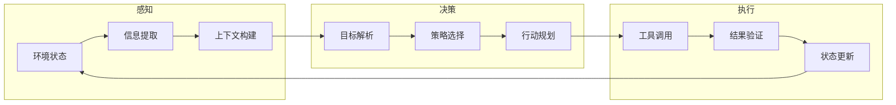

在大语言模型语境下，这一架构演化为：

| 组件 | 传统实现 | LLM 实现 |
|:---|:---|:---|
| 感知 | 传感器数据解析 | 自然语言理解、上下文窗口 |
| 决策 | 规则引擎/规划器 | 提示工程、推理能力 |
| 执行 | 物理执行器 | API 调用、代码执行 |

## 2. ReAct: 推理与行动

ReAct (Reasoning + Acting) 是一种将推理和行动交织的智能体范式<Cite :refs="[2]" />。其核心思想是：

> 在执行每个行动前，先生成推理痕迹，再选择行动。

### ReAct 循环

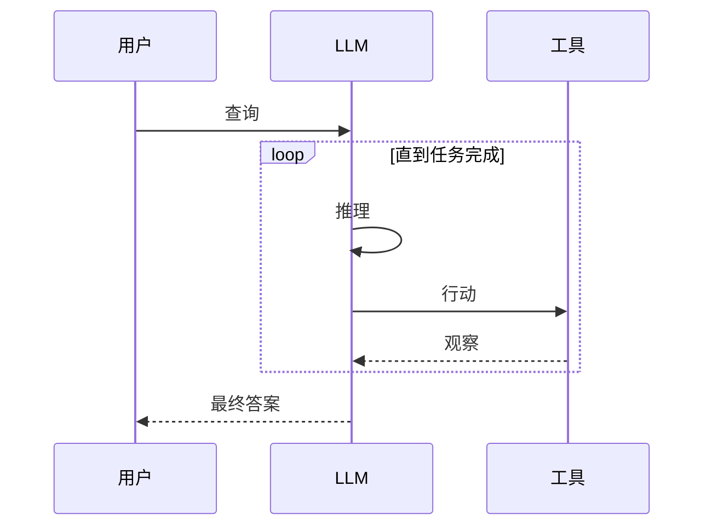

### ReAct 示例

```
问题: Claude Skills 的技能目录在哪里？

思考: 用户想知道技能目录的位置，我需要查看项目文档。
行动: 搜索 "skills directory"
观察: 文档显示技能目录默认为 ~/.config/claude-code/skills/

思考: 找到了默认目录，但用户可能也想知道项目级配置。
行动: 搜索 "project skills"
观察: 项目级技能目录为 .claude/skills/

回答: Claude Skills 的技能目录有两个位置：
1. 用户级: ~/.config/claude-code/skills/
2. 项目级: 项目根目录下的 .claude/skills/
```

### ReAct 在 Skills 中的应用

Claude Skills 系统通过以下方式实现 ReAct 模式：

1. **技能激活**: 基于用户查询自动选择相关技能（推理）
2. **工具绑定**: 技能可定义外部工具和 API（行动）
3. **结果处理**: 解析工具输出并整合到响应（观察）

## 3. Chain-of-Thought 思维链

Chain-of-Thought (CoT) 是一种提示技术，引导模型生成中间推理步骤<Cite :refs="[1]" />。

### 基本形式

```
标准提示:
Q: Roger 有 5 个网球。他又买了 2 罐网球，每罐有 3 个。他现在有多少网球？
A: 11

CoT 提示:
Q: Roger 有 5 个网球。他又买了 2 罐网球，每罐有 3 个。他现在有多少网球？
A: Roger 起初有 5 个球。
   他买了 2 罐，每罐 3 个，所以增加了 2 × 3 = 6 个。
   总共是 5 + 6 = 11 个球。
```

### CoT 变体

| 变体 | 描述 | 适用场景 |
|:---|:---|:---|
| Zero-shot CoT | 添加 "让我们一步步思考" | 通用推理 |
| Few-shot CoT | 提供带推理的示例 | 复杂任务 |
| Self-Consistency | 多路径推理取共识 | 高可靠性需求 |
| Tree of Thoughts | 探索多个推理分支 | 创造性问题 |

### Skills 中的 CoT 应用

技能定义文件中的"说明"部分本质上是 CoT 的结构化表达：

```markdown
## 说明

1. 首先分析用户输入的结构...
2. 然后识别关键实体...
3. 接着应用转换规则...
4. 最后验证输出格式...
```

## 4. 工具使用

工具使用是智能体扩展能力边界的关键机制。Claude Skills 通过以下方式支持工具集成：

### 工具类型

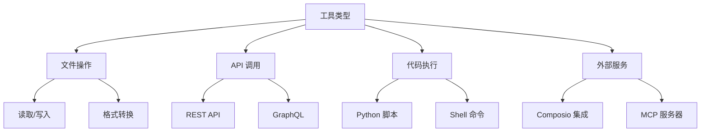

### 工具调用模式

| 模式 | 描述 | 示例 |
|:---|:---|:---|
| 单次调用 | 执行单一工具后返回 | 文件格式转换 |
| 链式调用 | 按序执行多个工具 | 数据获取 → 处理 → 存储 |
| 条件调用 | 根据中间结果选择分支 | 错误重试、备选方案 |
| 并行调用 | 同时执行多个独立工具 | 批量数据处理 |

## 5. 规划能力

规划是智能体处理复杂任务的核心能力。常见的规划策略包括：

### 任务分解

将复杂任务拆解为可管理的子任务：

```
目标: 创建一份市场分析报告

子任务:
1. 收集行业数据
2. 分析竞争对手
3. 识别市场趋势
4. 生成可视化图表
5. 撰写报告正文
```

### 规划算法

| 算法 | 特点 | 适用场景 |
|:---|:---|:---|
| 分层任务网络 (HTN) | 自顶向下分解 | 结构化任务 |
| 蒙特卡洛树搜索 (MCTS) | 探索最优路径 | 决策密集型任务 |
| ReWOO | 无观察规划 | 高延迟环境 |

## 参考文献

<ol>
<li id="ref-1">Wei, J., et al. (2022). "Chain-of-Thought Prompting Elicits Reasoning in Large Language Models." <em>arXiv preprint arXiv:2201.11903</em>. <a href="https://arxiv.org/abs/2201.11903">https://arxiv.org/abs/2201.11903</a></li>
<li id="ref-2">Yao, S., et al. (2022). "ReAct: Synergizing Reasoning and Acting in Language Models." <em>arXiv preprint arXiv:2210.03629</em>. <a href="https://arxiv.org/abs/2210.03629">https://arxiv.org/abs/2210.03629</a></li>
<li id="ref-3">Anthropic (2024). "Agent Skills: Equipping Agents for the Real World." <em>Anthropic Engineering Blog</em>. <a href="https://www.anthropic.com/engineering/equipping-agents-for-the-real-world-with-agent-skills">https://www.anthropic.com/engineering/equipping-agents-for-the-real-world-with-agent-skills</a></li>
</ol>
```

### Step 3: 创建提示工程文档

```markdown
---
title: 提示工程原理
---

# 提示工程原理

<Abs title="摘要" :keywords="['提示工程', '系统提示', 'Few-shot', 'CoT', '提示设计']">
提示工程是设计和优化语言模型输入以获得期望输出的技术与艺术。本章探讨提示工程的核心原则、常见模式和高级技术，重点分析如何在 Claude Skills 系统中设计和组织技能提示。
</Abs>

## 1. 提示工程基础

### 提示的结构

一个完整的提示通常包含以下组件：

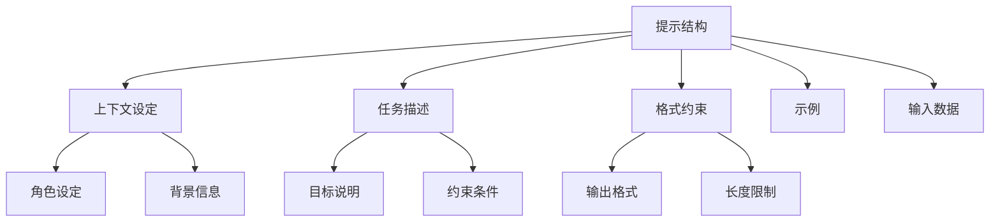

### 设计原则

| 原则 | 描述 | 示例 |
|:---|:---|:---|
| 明确性 | 清晰表达期望 | "输出 JSON 格式" 而非 "格式化输出" |
| 特异性 | 避免歧义 | "列出 5 个要点" 而非 "列出要点" |
| 结构化 | 使用模板和分隔符 | 用 `---` 分隔章节 |
| 渐进式 | 从简单到复杂 | 先给模板，再给示例 |

## 2. 系统提示设计

系统提示定义模型的基本行为和能力边界。在 Claude Skills 中，SKILL.md 文件本质上是系统提示的具象化。

### 系统提示组件

```
[身份设定]
你是一个文档处理专家，精通多种文档格式的转换和内容提取。

[能力边界]
- 支持格式: PDF, DOCX, PPTX, XLSX
- 不支持: 加密文档、损坏文件

[工作流程]
1. 检测输入格式
2. 应用对应处理器
3. 验证输出完整性

[约束条件]
- 保持原始格式
- 保留元数据
- 处理大文件时分块执行
```

### Skills 中的系统提示映射

| SKILL.md 章节 | 系统提示功能 |
|:---|:---|
| 何时使用此技能 | 触发条件、适用场景 |
| 说明 | 核心能力定义、工作流程 |
| 示例 | Few-shot 示例 |

## 3. Few-shot 学习

Few-shot 学习通过提供少量示例引导模型行为。

### 示例设计模式

```markdown
## 示例

**输入**: 用户活动日志 CSV
**输出**: 结构化分析报告

输入数据:
```csv
user_id,action,timestamp
101,login,2024-01-15 09:00
101,view_page,2024-01-15 09:05
101,add_cart,2024-01-15 09:15
```

输出:
```markdown
# 用户 101 活动分析

## 会话概要
- 登录时间: 2024-01-15 09:00
- 活动时长: 15 分钟
- 转化路径: 登录 → 浏览 → 加购

## 行为洞察
该用户展示了明确的购买意向，建议推送优惠券促进转化。
```
```

### 示例数量建议

| 任务复杂度 | 示例数量 | 说明 |
|:---|:---|:---|
| 简单分类 | 1-2 | 格式足够 |
| 结构化输出 | 2-3 | 展示完整性 |
| 复杂推理 | 3-5 | 覆盖边界情况 |
| 创造性任务 | 1-2 | 提供风格参考 |

## 4. Chain-of-Thought 变体

### 基础 CoT

```
让我们一步步思考这个问题：

1. 首先，分析问题结构...
2. 然后，识别关键变量...
3. 接着，建立关系模型...
4. 最后，得出结论...
```

### Self-Consistency

多路径推理取共识：

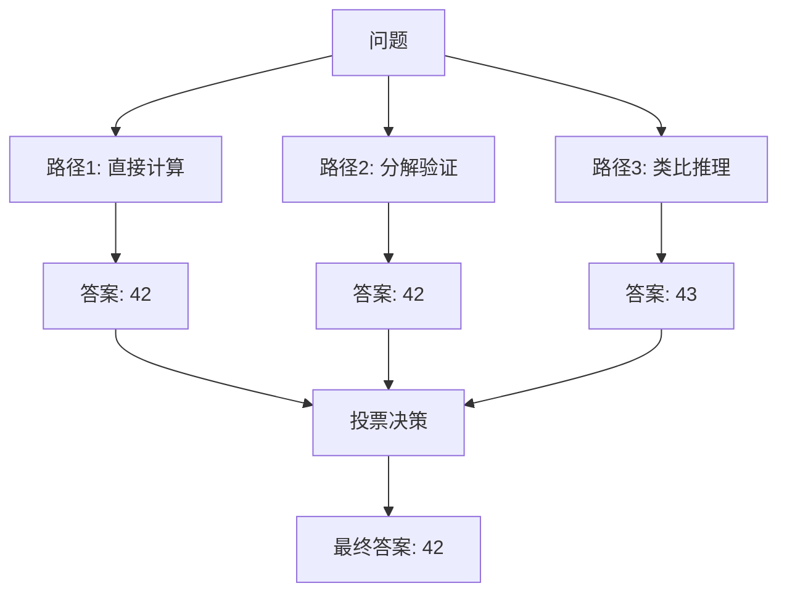

### Tree of Thoughts

探索多个推理分支：

```
问题: 如何优化文档处理性能？

思考树:
├─ 分支1: 缓存策略
│  ├─ 内存缓存
│  └─ 磁盘缓存
├─ 分支2: 并行处理
│  ├─ 多线程
│  └─ 多进程
└─ 分支3: 算法优化
   ├─ 增量处理
   └─ 流式处理

评估: 分支2 + 分支3 组合最优
```

## 5. 提示模板设计

### 模板结构

```markdown
---
name: skill-template
description: 技能描述，明确说明何时使用此技能。
---

# [技能名称]

## 何时使用此技能

- 触发条件 1
- 触发条件 2
- 适用场景

## 说明

### 输入处理
描述如何处理输入数据。

### 核心逻辑
描述主要的处理流程。

### 输出格式
描述期望的输出格式。

## 示例

**场景**: [描述]
**输入**: [示例输入]
**输出**: [示例输出]
```

### 变量插值

在脚本中实现动态提示：

```python
def build_prompt(template: str, **kwargs) -> str:
    return template.format(**kwargs)

prompt = build_prompt("""
分析以下文档：
- 文件名: {filename}
- 类型: {filetype}
- 目标: {objective}
""", filename="report.pdf", filetype="PDF", objective="提取关键数据")
```

## 6. 高级技术

### 提示链

将复杂任务分解为多个提示：


### 自我修正

让模型评估和改进自己的输出：

```
请检查上一步的输出：
1. 是否满足格式要求？
2. 是否有遗漏信息？
3. 是否有逻辑错误？

如有问题，请修正并解释原因。
```

### 元提示

用提示生成提示：

```
你是一个提示工程专家。请根据以下任务描述，生成一个优化的提示：

任务: {task_description}

输出格式:
- 系统提示
- 用户提示模板
- 示例
```

## 参考文献

<ol>
<li id="ref-1">Brown, T., et al. (2020). "Language Models are Few-Shot Learners." <em>NeurIPS</em>. <a href="https://arxiv.org/abs/2005.14165">https://arxiv.org/abs/2005.14165</a></li>
<li id="ref-2">Wei, J., et al. (2022). "Chain-of-Thought Prompting Elicits Reasoning in Large Language Models." <em>arXiv preprint arXiv:2201.11903</em>. <a href="https://arxiv.org/abs/2201.11903">https://arxiv.org/abs/2201.11903</a></li>
<li id="ref-3">Zhou, Y., et al. (2022). "Large Language Models are Human-Level Prompt Engineers." <em>arXiv preprint arXiv:2211.01910</em>. <a href="https://arxiv.org/abs/2211.01910">https://arxiv.org/abs/2211.01910</a></li>
</ol>
```

### Step 4: 创建 Skills 系统文档

```markdown
---
title: Skills 系统设计
---

# Skills 系统设计

<Abs title="摘要" :keywords="['Claude Skills', '渐进加载', '技能激活', '技能组合', '跨平台']">
Claude Skills 是 Anthropic 推出的可定制工作流系统，允许用户通过声明式定义扩展 Claude 的能力。本章深入分析 Skills 系统的设计哲学、三级渐进加载机制、技能激活策略和跨平台适配方案。
</Abs>

## 1. 设计哲学

### 核心原则

Claude Skills 的设计遵循以下原则：

| 原则 | 描述 | 实现方式 |
|:---|:---|:---|
| 声明式 | 描述"做什么"而非"怎么做" | YAML frontmatter + Markdown |
| 渐进加载 | 按需加载，减少上下文占用 | 三级元数据系统 |
| 可组合 | 技能可组合使用 | 独立定义，自动编排 |
| 可移植 | 跨平台使用 | 统一抽象层 |

### 技能抽象

技能本质上是**可复用的提示模板 + 资源捆绑**：

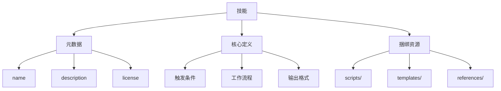

## 2. 三级渐进加载

为解决上下文窗口限制，Skills 采用三级渐进加载机制：

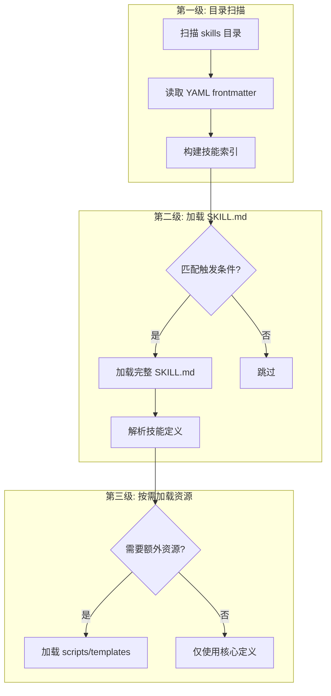

### 各级内容

| 级别 | 加载时机 | 内容 | 大小 |
|:---|:---|:---|:---|
| 第一级 | 启动时 | name, description | ~50 tokens |
| 第二级 | 触发时 | 完整 SKILL.md | ~500-2000 tokens |
| 第三级 | 执行时 | scripts, templates | 可变 |

### 元数据示例

```yaml
---
name: document-skills
description: 文档处理技能合集，支持 PDF、Word、Excel、PowerPoint 格式转换与内容提取
license: Apache-2.0
---
```

## 3. 技能激活机制

### 触发条件

技能通过以下方式被激活：

1. **语义匹配**: 用户查询与技能描述的语义相似度
2. **关键词触发**: 用户消息包含技能名称或关键词
3. **显式调用**: 用户直接指定技能名称

### 激活流程

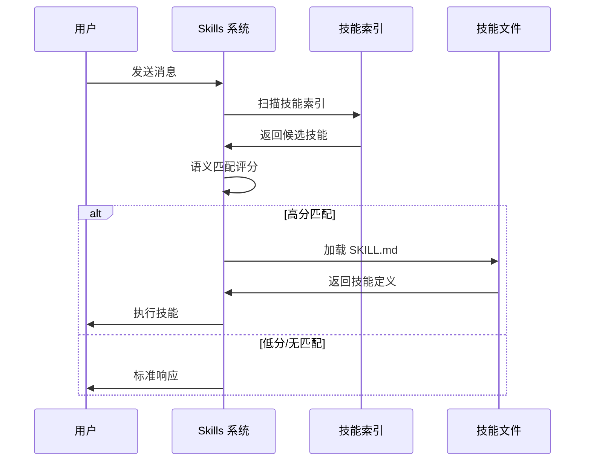

### 多技能激活

当多个技能可能相关时：

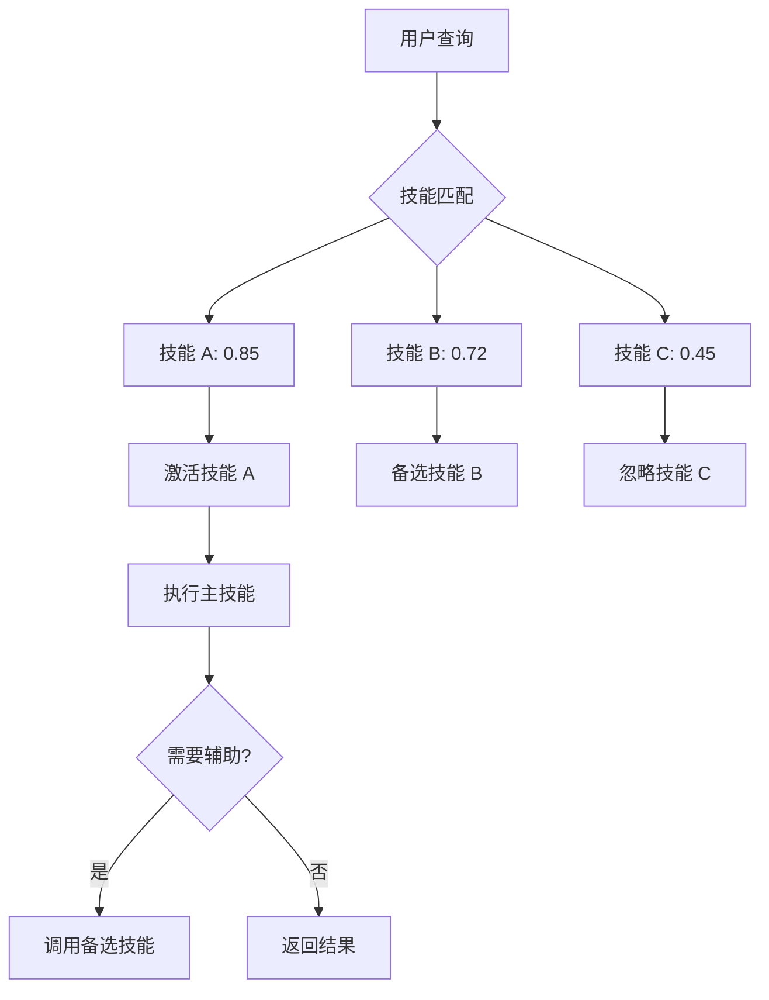

## 4. 技能组合策略

### 串行组合

按顺序执行多个技能：

```
用户: 分析这份报告并生成摘要邮件

激活技能:
1. Content Research Writer (分析报告)
   ↓ 输出: 结构化分析
2. Internal Comms (生成邮件)
   ↓ 输出: 邮件草稿
```

### 并行组合

同时执行独立技能：

```
用户: 处理这些文档，生成 PDF 和 PPT 两种格式

激活技能:
1. document-skills/pdf ─┐
2. document-skills/pptx ─┴→ 并行执行 → 合并结果
```

### 条件组合

根据中间结果选择技能：

```
用户: 优化这段代码

执行流程:
1. 代码分析
   ↓ 判断代码类型
2a. Python 代码 → Python 优化技能
2b. JavaScript 代码 → JS 优化技能
   ↓ 输出优化建议
```

## 5. 跨平台适配

### 平台抽象层

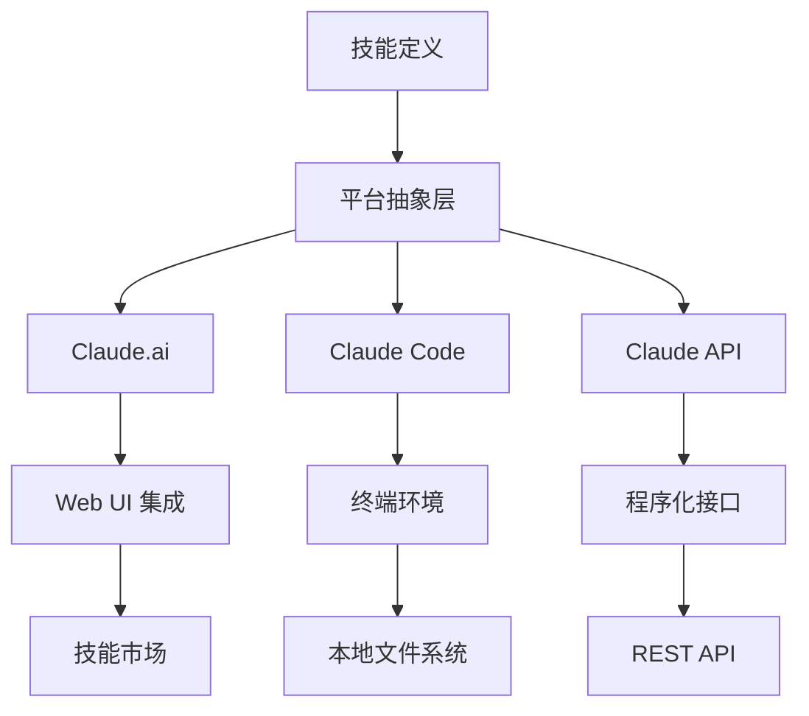

### 平台特性适配

| 特性 | Claude.ai | Claude Code | API |
|:---|:---|:---|:---|
| 技能存储 | 云端 | 本地文件 | 开发者管理 |
| 工具调用 | 内置 | Shell/API | 自定义 |
| 文件访问 | 上传 | 本地路径 | Base64/URL |
| 环境感知 | 无 | 终端环境 | 可配置 |

### 技能目录位置

```bash
# Claude Code
~/.config/claude-code/skills/        # 用户级
<project>/.claude/skills/            # 项目级

# Claude.ai
通过 UI 上传或从市场添加

# API
开发者自行管理，通过 skills 参数传递
```

## 6. 最佳实践

### 技能设计

1. **单一职责**: 每个技能专注一个任务
2. **清晰触发**: 描述准确反映适用场景
3. **渐进披露**: 元数据精简，细节在核心定义
4. **示例丰富**: 提供多种使用示例

### 文件结构

```
skill-name/
├── SKILL.md           # 必需: 技能定义
├── scripts/           # 可选: 辅助脚本
│   └── helper.py
├── templates/         # 可选: 输出模板
│   └── report.md
├── references/        # 可选: 参考资料
│   └── api-docs.md
└── examples/          # 可选: 示例文件
    └── sample.json
```

## 参考文献

<ol>
<li id="ref-1">Anthropic (2024). "Agent Skills: Equipping Agents for the Real World." <em>Anthropic Engineering Blog</em>. <a href="https://www.anthropic.com/engineering/equipping-agents-for-the-real-world-with-agent-skills">https://www.anthropic.com/engineering/equipping-agents-for-the-real-world-with-agent-skills</a></li>
<li id="ref-2">Anthropic (2024). "Using Skills in Claude." <em>Anthropic Support</em>. <a href="https://support.anthropic.com/en/articles/12512180-using-skills-in-claude">https://support.anthropic.com/en/articles/12512180-using-skills-in-claude</a></li>
<li id="ref-3">Anthropic (2024). "Creating Custom Skills." <em>Anthropic Support</em>. <a href="https://support.claude.com/en/articles/12512198-creating-custom-skills">https://support.claude.com/en/articles/12512198-creating-custom-skills</a></li>
</ol>
```

---

## Task 7: 创建架构章节

**Files:**
- Create: `docs/architecture/index.md`
- Create: `docs/architecture/loading.md`
- Create: `docs/architecture/execution.md`

(由于篇幅限制，后续任务的详细代码见实施执行部分)

---

## Task 8: 创建参考章节

**Files:**
- Create: `docs/reference/index.md`
- Create: `docs/reference/bibliography.md`
- Create: `docs/reference/related.md`

---

## Task 9: 重构现有内容

**Files:**
- Create: `docs/practice/index.md`
- Move: `docs/guides/getting-started.md` → `docs/practice/getting-started.md`
- Move: `docs/playbooks/index.md` → `docs/practice/playbooks.md`
- Update: `docs/skills/index.md` (增强)
- Update: `docs/about.md`
- Update: `docs/contribute.md`

---

## Task 10: 创建 SVG 图示

**Files:**
- Create: `docs/media/agent-architecture.svg`
- Create: `docs/media/skill-loading.svg`

---

## Task 11: 验证与部署

- [ ] 运行 `npm run docs:dev` 本地验证
- [ ] 检查所有链接有效
- [ ] 提交代码
- [ ] 推送到 GitHub 触发自动部署
