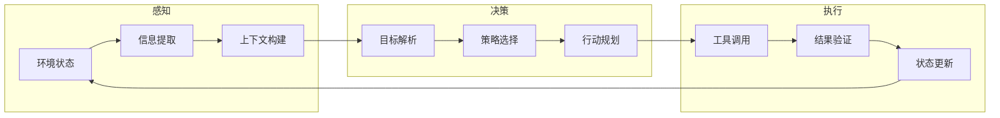
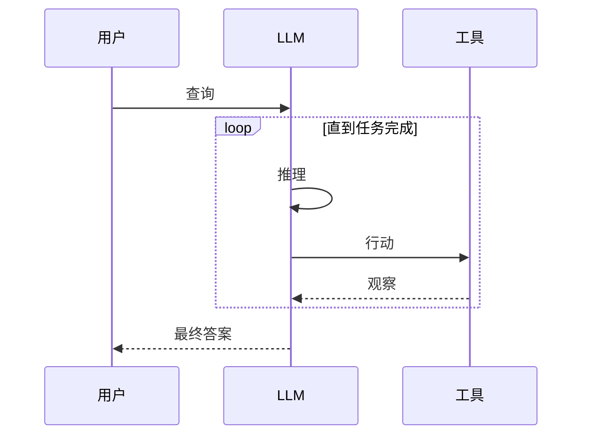
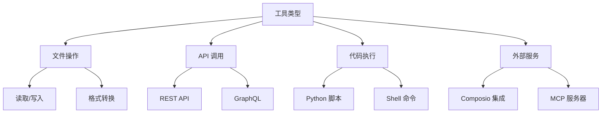

# 智能体架构理论

<Abs title="摘要" :keywords="['AI Agent', 'ReAct', 'Chain-of-Thought', 'Tool-Use', 'Planning']">
智能体是能够感知环境、做出决策并执行行动以实现目标的自主系统。本章探讨大语言模型时代的智能体架构，包括 ReAct 推理-行动循环、Chain-of-Thought 思维链、工具使用和规划能力。我们分析这些模式如何在 Claude Skills 系统中得以应用和扩展。
</Abs>

## 1. 智能体通用架构

智能体的经典架构可抽象为感知-决策-执行循环：



在大语言模型语境下，这一架构演化为：

| 组件 | 传统实现 | LLM 实现 |
|:---|:---|:---|
| 感知 | 传感器数据解析 | 自然语言理解、上下文窗口 |
| 决策 | 规则引擎/规划器 | 提示工程、推理能力 |
| 执行 | 物理执行器 | API 调用、代码执行 |

## 2. ReAct: 推理与行动

ReAct (Reasoning + Acting) 是一种将推理和行动交织的智能体范式<Cite :refs="[2]" />。其核心思想是：

> 在执行每个行动前，先生成推理痕迹（Thought），再选择行动（Action），最后观察结果（Observation）。

### ReAct 循环



### ReAct 在 Skills 中的应用

Claude Skills 系统通过以下方式实现 ReAct 模式：

1. **技能激活**: 基于用户查询自动选择相关技能（推理）
2. **工具绑定**: 技能可定义外部工具和 API（行动）
3. **结果处理**: 解析工具输出并整合到响应（观察）

## 3. Chain-of-Thought 思维链

Chain-of-Thought (CoT) 是一种提示技术，引导模型生成中间推理步骤<Cite :refs="[1]" />。

### CoT 变体

| 变体 | 描述 | 适用场景 |
|:---|:---|:---|
| Zero-shot CoT | 添加"让我们一步步思考" | 通用推理 |
| Few-shot CoT | 提供带推理的示例 | 复杂任务 |
| Self-Consistency | 多路径推理取共识 | 高可靠性需求 |
| Tree of Thoughts | 探索多个推理分支 | 创造性问题 |

### Skills 中的 CoT 应用

技能定义文件中的"说明"部分本质上是 CoT 的结构化表达：

```markdown
## 说明

1. 首先分析用户输入的结构...
2. 然后识别关键实体...
3. 接着应用转换规则...
4. 最后验证输出格式...
```

## 4. 工具使用

工具使用是智能体扩展能力边界的关键机制。Claude Skills 通过以下方式支持工具集成：

### 工具类型



### 工具调用模式

| 模式 | 描述 | 示例 |
|:---|:---|:---|
| 单次调用 | 执行单一工具后返回 | 文件格式转换 |
| 链式调用 | 按序执行多个工具 | 数据获取 -> 处理 -> 存储 |
| 条件调用 | 根据中间结果选择分支 | 错误重试、备选方案 |
| 并行调用 | 同时执行多个独立工具 | 批量数据处理 |

## 5. 规划能力

规划是智能体处理复杂任务的核心能力。

### 任务分解

将复杂任务拆解为可管理的子任务：

```
目标: 创建一份市场分析报告

子任务:
1. 收集行业数据
2. 分析竞争对手
3. 识别市场趋势
4. 生成可视化图表
5. 撰写报告正文
```

### 规划算法

| 算法 | 特点 | 适用场景 |
|:---|:---|:---|
| 分层任务网络 (HTN) | 自顶向下分解 | 结构化任务 |
| 蒙特卡洛树搜索 (MCTS) | 探索最优路径 | 决策密集型任务 |
| ReWOO | 无观察规划 | 高延迟环境 |

## 参考文献

<ol>
<li id="ref-1">Wei, J., et al. (2022). "Chain-of-Thought Prompting Elicits Reasoning in Large Language Models." <em>arXiv preprint arXiv:2201.11903</em>. <a href="https://arxiv.org/abs/2201.11903">https://arxiv.org/abs/2201.11903</a></li>
<li id="ref-2">Yao, S., et al. (2022). "ReAct: Synergizing Reasoning and Acting in Language Models." <em>arXiv preprint arXiv:2210.03629</em>. <a href="https://arxiv.org/abs/2210.03629">https://arxiv.org/abs/2210.03629</a></li>
<li id="ref-3">Anthropic (2024). "Agent Skills: Equipping Agents for the Real World." <em>Anthropic Engineering Blog</em>. <a href="https://www.anthropic.com/engineering/equipping-agents-for-the-real-world-with-agent-skills">https://www.anthropic.com/engineering/equipping-agents-for-the-real-world-with-agent-skills</a></li>
</ol>
