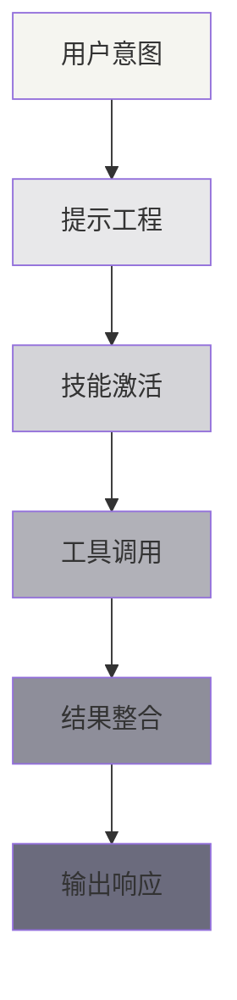

# 理论基础

<Abs title="章节概述" :keywords="['AI Agent', '提示工程', 'Skills 系统', '理论基础']">
本章阐述 Claude Skills 的理论基础。我们从智能体架构的通用框架出发，分析 ReAct、Chain-of-Thought 等核心推理模式，探讨提示工程的设计原则，最后深入 Skills 系统的设计哲学与实现原理。理解这些理论基础，是有效使用和扩展 Claude Skills 的前提。
</Abs>

## 章节内容

| 章节 | 内容概要 |
|:---|:---|
| [智能体架构](./agent-arch) | Agent 通用架构、推理模式、工具使用理论 |
| [提示工程](./prompt-eng) | 系统提示设计、Few-shot 学习、CoT 变体 |
| [Skills 系统](./skill-system) | 技能抽象、渐进加载、激活机制 |

## 阅读建议

1. **初学者**: 建议先阅读 [技能系统](./skill-system) 了解基本概念，再回溯理论基础
2. **研究者**: 可按顺序阅读，建立完整理论框架
3. **实践者**: 重点阅读 [提示工程](./prompt-eng) 的设计模式部分

## 核心概念预览

## 参考文献导引

本章内容参考了以下核心文献：

- Wei et al. (2022) "Chain-of-Thought Prompting Elicits Reasoning in Large Language Models"<Cite :refs="[1]" />
- Yao et al. (2022) "ReAct: Synergizing Reasoning and Acting in Language Models"<Cite :refs="[2]" />
- Anthropic (2024) "Agent Skills: Equipping Agents for the Real World"<Cite :refs="[3]" />

完整参考文献见 [参考文献](/reference/bibliography)。
