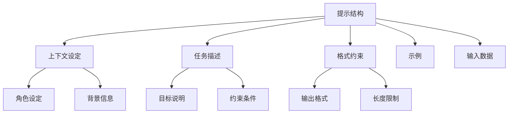
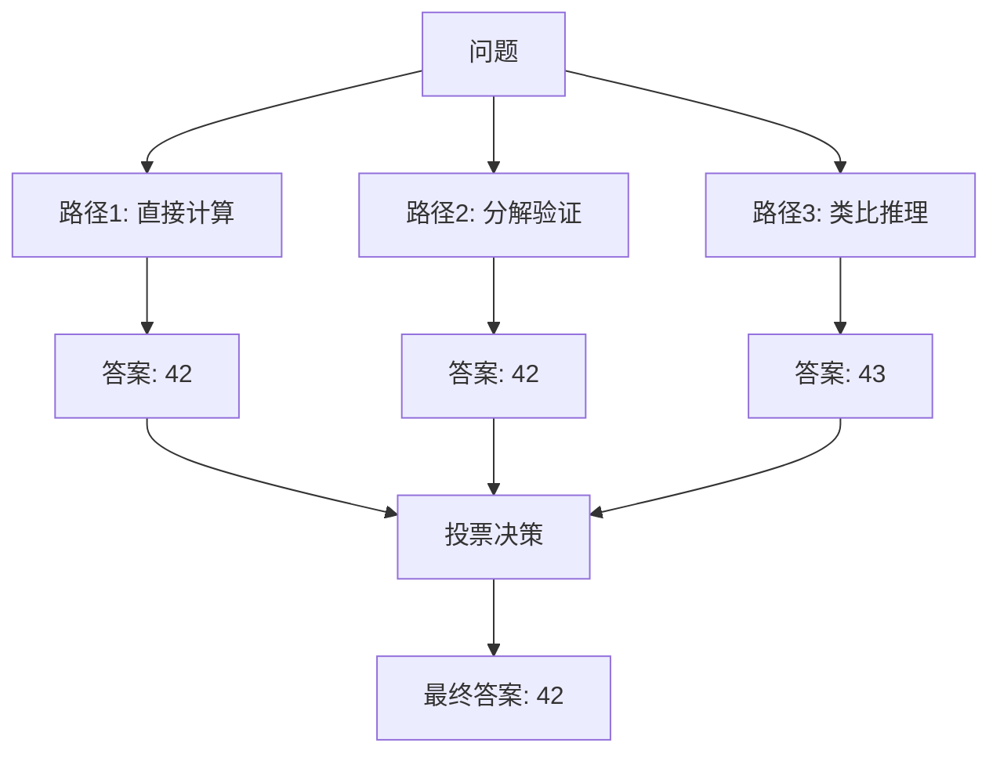

# 提示工程原理

<Abs title="摘要" :keywords="['提示工程', '系统提示', 'Few-shot', 'CoT', '提示设计']">
提示工程是设计和优化语言模型输入以获得期望输出的技术与艺术。本章探讨提示工程的核心原则、常见模式和高级技术，重点分析如何在 Claude Skills 系统中设计和组织技能提示。
</Abs>

## 1. 提示工程基础

### 提示的结构

一个完整的提示通常包含以下组件：



### 设计原则

| 原则 | 描述 | 示例 |
|:---|:---|:---|
| 明确性 | 清晰表达期望 | "输出 JSON 格式" 而非 "格式化输出" |
| 特异性 | 避免歧义 | "列出 5 个要点" 而非 "列出要点" |
| 结构化 | 使用模板和分隔符 | 用 `---` 分隔章节 |
| 渐进式 | 从简单到复杂 | 先给模板，再给示例 |

## 2. 系统提示设计

系统提示定义模型的基本行为和能力边界。在 Claude Skills 中，SKILL.md 文件本质上是系统提示的具象化。

### 系统提示组件

```
[身份设定]
你是一个文档处理专家，精通多种文档格式的转换和内容提取。

[能力边界]
- 支持格式: PDF, DOCX, PPTX, XLSX
- 不支持: 加密文档、损坏文件

[工作流程]
1. 检测输入格式
2. 应用对应处理器
3. 验证输出完整性

[约束条件]
- 保持原始格式
- 保留元数据
- 处理大文件时分块执行
```

### Skills 中的系统提示映射

| SKILL.md 章节 | 系统提示功能 |
|:---|:---|
| 何时使用此技能 | 触发条件、适用场景 |
| 说明 | 核心能力定义、工作流程 |
| 示例 | Few-shot 示例 |

## 3. Few-shot 学习

Few-shot 学习通过提供少量示例引导模型行为<Cite :refs="[1]" />。

### 示例数量建议

| 任务复杂度 | 示例数量 | 说明 |
|:---|:---|:---|
| 简单分类 | 1-2 | 格式足够 |
| 结构化输出 | 2-3 | 展示完整性 |
| 复杂推理 | 3-5 | 覆盖边界情况 |
| 创造性任务 | 1-2 | 提供风格参考 |

### Skills 中的 Few-shot 实现

SKILL.md 的"示例"部分即为 Few-shot 提示：

```markdown
## 示例

**输入**: 用户活动日志 CSV
**输出**: 结构化分析报告

输入数据:
``csv
user_id,action,timestamp
101,login,2024-01-15 09:00
```

输出:
``markdown
# 用户 101 活动分析
该用户展示了明确的购买意向。
```
```

## 4. Chain-of-Thought 变体

### Self-Consistency

多路径推理取共识：



### Tree of Thoughts

探索多个推理分支：

```
问题: 如何优化文档处理性能？

思考树:
+-- 分支1: 缓存策略
|   +-- 内存缓存
|   +-- 磁盘缓存
+-- 分支2: 并行处理
|   +-- 多线程
|   +-- 多进程
+-- 分支3: 算法优化
    +-- 增量处理
    +-- 流式处理

评估: 分支2 + 分支3 组合最优
```

## 5. 提示模板设计

### 模板结构

```markdown
---
name: skill-template
description: 技能描述，明确说明何时使用此技能。
---

# [技能名称]

## 何时使用此技能

- 触发条件 1
- 触发条件 2

## 说明

### 输入处理
描述如何处理输入数据。

### 核心逻辑
描述主要的处理流程。

### 输出格式
描述期望的输出格式。

## 示例

**场景**: [描述]
**输入**: [示例输入]
**输出**: [示例输出]
```

### 变量插值

在脚本中实现动态提示：

```python
def build_prompt(template: str, **kwargs) -> str:
    return template.format(**kwargs)

prompt = build_prompt("""
分析以下文档：
- 文件名: {filename}
- 类型: {filetype}
- 目标: {objective}
""", filename="report.pdf", filetype="PDF", objective="提取关键数据")
```

## 6. 高级技术

### 提示链

将复杂任务分解为多个提示：


### 自我修正

让模型评估和改进自己的输出：

```
请检查上一步的输出：
1. 是否满足格式要求？
2. 是否有遗漏信息？
3. 是否有逻辑错误？

如有问题，请修正并解释原因。
```

### 元提示

用提示生成提示：

```
你是一个提示工程专家。请根据以下任务描述，生成一个优化的提示：

任务: {task_description}

输出格式:
- 系统提示
- 用户提示模板
- 示例
```

## 参考文献

<ol>
<li id="ref-1">Brown, T., et al. (2020). "Language Models are Few-Shot Learners." <em>NeurIPS</em>. <a href="https://arxiv.org/abs/2005.14165">https://arxiv.org/abs/2005.14165</a></li>
<li id="ref-2">Wei, J., et al. (2022). "Chain-of-Thought Prompting Elicits Reasoning in Large Language Models." <em>arXiv preprint arXiv:2201.11903</em>. <a href="https://arxiv.org/abs/2201.11903">https://arxiv.org/abs/2201.11903</a></li>
<li id="ref-3">Zhou, Y., et al. (2022). "Large Language Models are Human-Level Prompt Engineers." <em>arXiv preprint arXiv:2211.01910</em>. <a href="https://arxiv.org/abs/2211.01910">https://arxiv.org/abs/2211.01910</a></li>
</ol>
