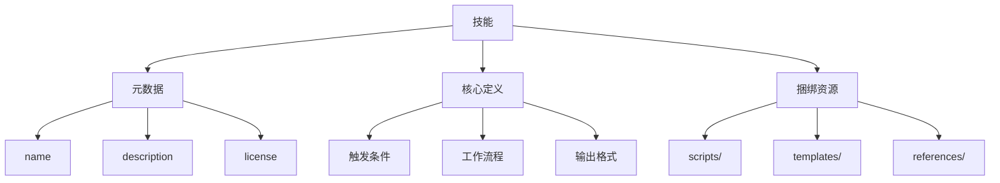
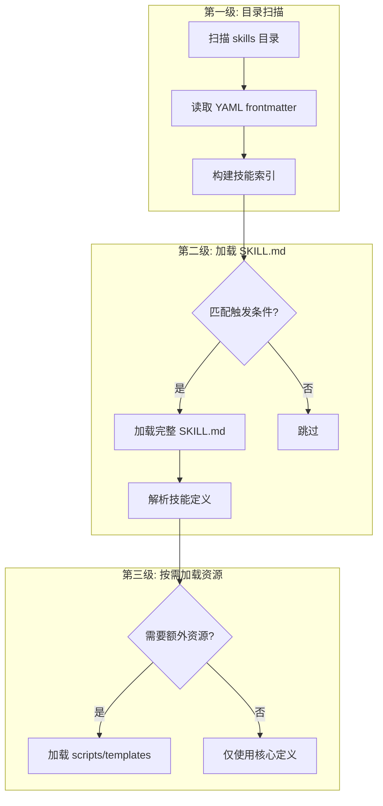
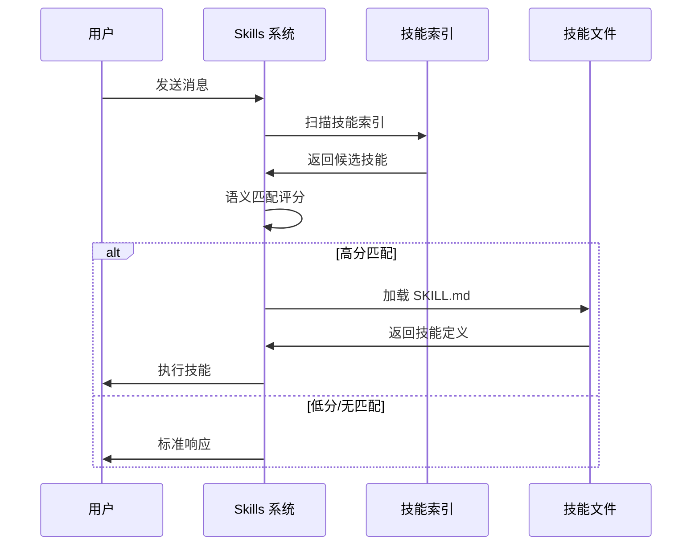
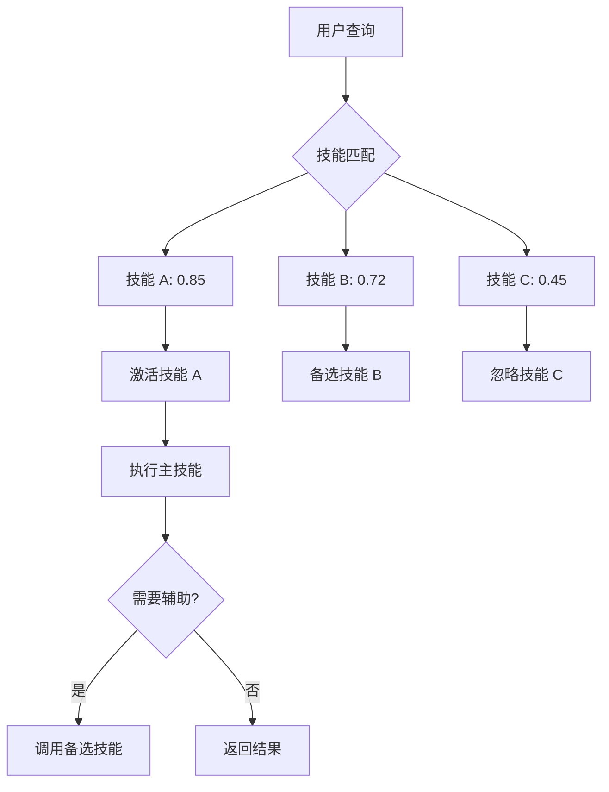
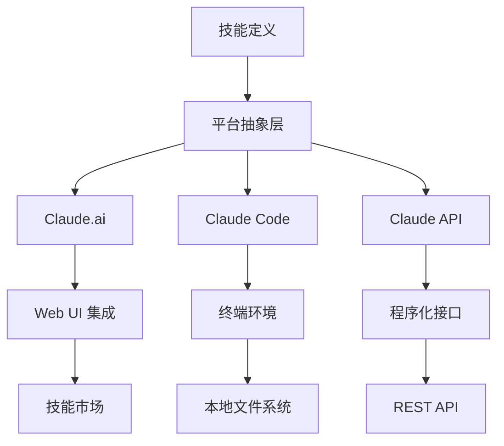

# Skills 系统设计

<Abs title="摘要" :keywords="['Claude Skills', '渐进加载', '技能激活', '技能组合', '跨平台']">
Claude Skills 是 Anthropic 推出的可定制工作流系统，允许用户通过声明式定义扩展 Claude 的能力。本章深入分析 Skills 系统的设计哲学、三级渐进加载机制、技能激活策略和跨平台适配方案。
</Abs>

## 1. 设计哲学

### 核心原则

| 原则 | 描述 | 实现方式 |
|:---|:---|:---|
| 声明式 | 描述"做什么"而非"怎么做" | YAML frontmatter + Markdown |
| 渐进加载 | 按需加载，减少上下文占用 | 三级元数据系统 |
| 可组合 | 技能可组合使用 | 独立定义，自动编排 |
| 可移植 | 跨平台使用 | 统一抽象层 |

### 技能抽象

技能本质上是**可复用的提示模板 + 资源捆绑**：



## 2. 三级渐进加载

为解决上下文窗口限制，Skills 采用三级渐进加载机制：



### 各级内容

| 级别 | 加载时机 | 内容 | 大小 |
|:---|:---|:---|:---|
| 第一级 | 启动时 | name, description | ~50 tokens |
| 第二级 | 触发时 | 完整 SKILL.md | ~500-2000 tokens |
| 第三级 | 执行时 | scripts, templates | 可变 |

### 元数据示例

```yaml
---
name: document-skills
description: 文档处理技能合集，支持 PDF、Word、Excel、PowerPoint 格式转换与内容提取
license: Apache-2.0
---
```

## 3. 技能激活机制

### 触发条件

技能通过以下方式被激活：

1. **语义匹配**: 用户查询与技能描述的语义相似度
2. **关键词触发**: 用户消息包含技能名称或关键词
3. **显式调用**: 用户直接指定技能名称

### 激活流程



### 多技能激活

当多个技能可能相关时：



## 4. 技能组合策略

### 串行组合

按顺序执行多个技能：

```
用户: 分析这份报告并生成摘要邮件

激活技能:
1. Content Research Writer (分析报告)
   -> 输出: 结构化分析
2. Internal Comms (生成邮件)
   -> 输出: 邮件草稿
```

### 并行组合

同时执行独立技能：

```
用户: 处理这些文档，生成 PDF 和 PPT 两种格式

激活技能:
1. document-skills/pdf ---
2. document-skills/pptx --- -> 并行执行 -> 合并结果
```

### 条件组合

根据中间结果选择技能：

```
用户: 优化这段代码

执行流程:
1. 代码分析
   -> 判断代码类型
2a. Python 代码 -> Python 优化技能
2b. JavaScript 代码 -> JS 优化技能
   -> 输出优化建议
```

## 5. 跨平台适配

### 平台抽象层



### 平台特性适配

| 特性 | Claude.ai | Claude Code | API |
|:---|:---|:---|:---|
| 技能存储 | 云端 | 本地文件 | 开发者管理 |
| 工具调用 | 内置 | Shell/API | 自定义 |
| 文件访问 | 上传 | 本地路径 | Base64/URL |
| 环境感知 | 无 | 终端环境 | 可配置 |

### 技能目录位置

```bash
# Claude Code
~/.config/claude-code/skills/        # 用户级
<project>/.claude/skills/            # 项目级

# Claude.ai
通过 UI 上传或从市场添加

# API
开发者自行管理，通过 skills 参数传递
```

## 6. 最佳实践

### 技能设计

1. **单一职责**: 每个技能专注一个任务
2. **清晰触发**: 描述准确反映适用场景
3. **渐进披露**: 元数据精简，细节在核心定义
4. **示例丰富**: 提供多种使用示例

### 文件结构

```
skill-name/
├── SKILL.md           # 必需: 技能定义
├── scripts/           # 可选: 辅助脚本
│   └── helper.py
├── templates/         # 可选: 输出模板
│   └── report.md
├── references/        # 可选: 参考资料
│   └── api-docs.md
└── examples/          # 可选: 示例文件
    └── sample.json
```

## 参考文献

<ol>
<li id="ref-1">Anthropic (2024). "Agent Skills: Equipping Agents for the Real World." <em>Anthropic Engineering Blog</em>. <a href="https://www.anthropic.com/engineering/equipping-agents-for-the-real-world-with-agent-skills">https://www.anthropic.com/engineering/equipping-agents-for-the-real-world-with-agent-skills</a></li>
<li id="ref-2">Anthropic (2024). "Using Skills in Claude." <em>Anthropic Support</em>. <a href="https://support.anthropic.com/en/articles/12512180-using-skills-in-claude">https://support.anthropic.com/en/articles/12512180-using-skills-in-claude</a></li>
<li id="ref-3">Anthropic (2024). "Creating Custom Skills." <em>Anthropic Support</em>. <a href="https://support.claude.com/en/articles/12512198-creating-custom-skills">https://support.claude.com/en/articles/12512198-creating-custom-skills</a></li>
</ol>
